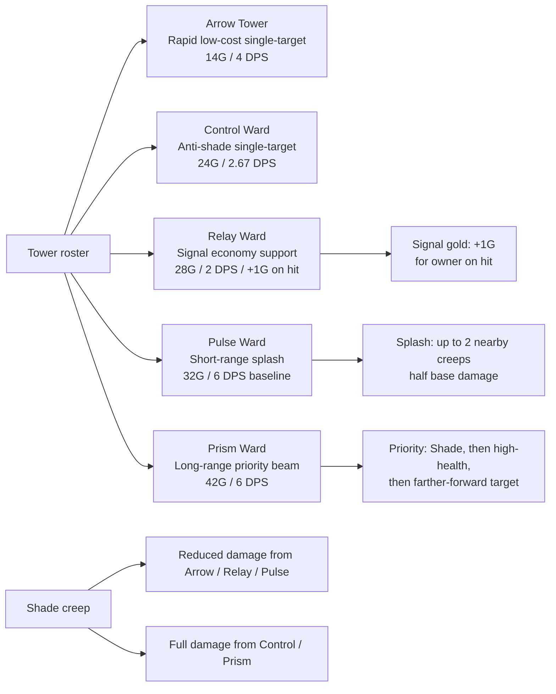
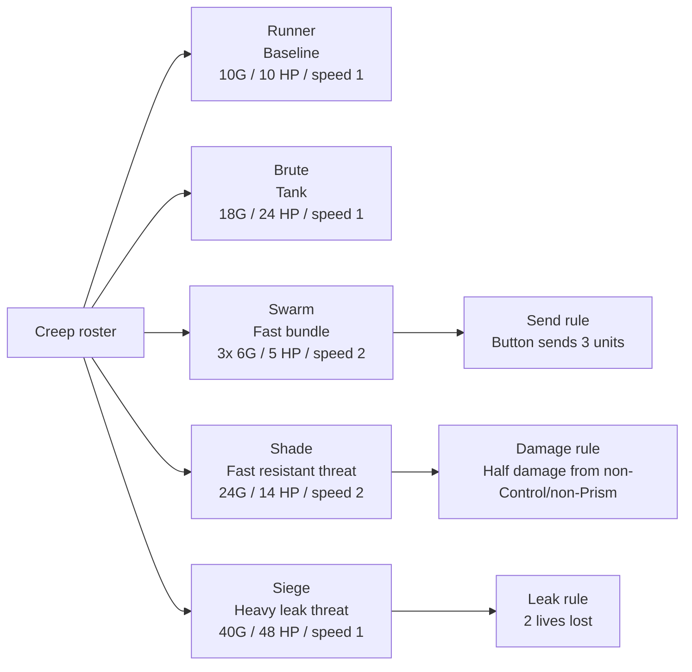
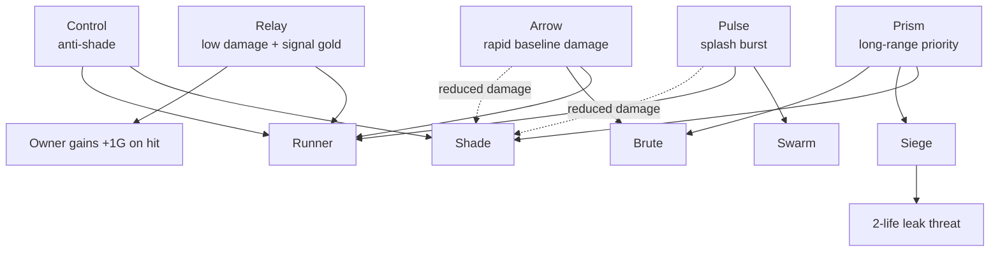

# Tower And Creep Roster

This is the current code-derived gameplay roster for the local vertical-slice build.

Source of truth:

- `src/LTW.Simulation/Bridge/SampleVerticalSliceContent.cs`
- `src/LTW.Simulation/Combat/CombatService.cs`
- `unity/LTW.UnityClient/Assets/Scripts/Simulation/UnitySimulationDriver.cs`
- `unity/LTW.UnityClient/Assets/Scripts/Simulation/UnityCommandAdapter.cs`

## Balance Math Assumptions

- Unity local client tick rate: `4` simulation ticks per second.
- Tower cooldown seconds: `AttackCooldownTicks / 4`.
- Tower shots per second: `4 / AttackCooldownTicks`.
- Listed tower DPS is single-target baseline DPS before special target rules.
- Tower range uses Manhattan grid distance.
- Creep `SpeedPerSecond` is currently applied once per simulation tick, so current local-client cells/sec is `SpeedPerSecond * 4`.
- Swarm is sent as a bundle of `3` units from the current Unity send drawer.

## Tower Roster

| Tower | ID | Weaponry / role | Cost | Range | Damage / shot | Cooldown ticks | Cooldown sec | Shots/sec | Baseline DPS | Special behavior |
| --- | --- | --- | ---: | ---: | ---: | ---: | ---: | ---: | ---: | --- |
| Arrow Tower | `tower.arrow` | Direct arrow shot; low-cost rapid single-target damage | 14 | 2 | 2 | 2 | 0.50 | 2.00 | 4.00 | Targets the front-most creep. Shade takes reduced damage from this tower. |
| Control Ward | `tower.control` | Control beam; anti-shade single-target utility | 24 | 2 | 2 | 3 | 0.75 | 1.33 | 2.67 | Targets the front-most creep and deals full damage to Shade. |
| Relay Ward | `tower.relay` | Relay spark; low-damage signal economy support | 28 | 2 | 2 | 4 | 1.00 | 1.00 | 2.00 | Generates +1 gold for its owner whenever it hits a creep. |
| Pulse Ward | `tower.pulse` | Pulse burst; short-range splash weapon | 32 | 1 | 6 | 4 | 1.00 | 1.00 | 6.00 | Splashes half damage to up to 2 nearby creeps within 1 cell of the target. Shade reduces non-control/non-prism damage. |
| Prism Ward | `tower.prism` | Prism beam; long-range priority weapon | 42 | 4 | 9 | 6 | 1.50 | 0.67 | 6.00 | Prioritizes Shade first, then higher-health and farther-forward targets. Deals full damage to Shade. |

Cost and damage were cut ~30%/~25-33% on 2026-07-27 to encourage building several cheaper, individually weaker towers early rather than one strong one — see `docs/GD_TUNING_LOG.md`'s "Tower Cost/Damage Cut" entry for the full rationale and before/after table.

## Tower Role Map

## Creep Roster

| Creep | ID | Role / pressure type | Button bundle | Unit cost | Button cost | Income gain / unit | Button income gain | Health / unit | Speed stat | Current cells/sec | Kill bounty / unit | Leak bounty / unit | Lives lost on leak | Special behavior |
| --- | --- | --- | ---: | ---: | ---: | ---: | ---: | ---: | ---: | ---: | ---: | ---: | ---: | --- |
| Runner | `creep.runner` | Baseline pressure runner | 1 | 10 | 10 | +1 | +1 | 10 | 1 | 4 | 1 | 2 | 1 | Simple baseline creep. |
| Brute | `creep.brute` | Durable tank pressure | 1 | 18 | 18 | +2 | +2 | 24 | 1 | 4 | 2 | 3 | 1 | High health for its cost tier. |
| Swarm | `creep.swarm` | Fast multi-unit pressure | 3 | 6 | 18 | +1 | +3 | 5 | 2 | 8 | 1 | 1 | 1 each | Current send button creates 3 low-health fast units. |
| Shade | `creep.shade` | Fast stealth/resistance pressure | 1 | 24 | 24 | +3 | +3 | 14 | 2 | 8 | 2 | 4 | 1 | Takes reduced damage from non-Control and non-Prism towers. |
| Siege | `creep.siege` | Heavy leak-threat tank | 1 | 40 | 40 | +4 | +4 | 48 | 1 | 4 | 4 | 6 | 2 | Leaking Siege costs the defender 2 lives. |

## Creep Roster — Category 2 (2026-07-28)

Second five, wired in behind the send menu's Category 2 (`docs/CONTENT_ROSTER_EXPANSION_PLAN.md`'s "second five," `docs/GAME_MENU_AND_RUNTIME_FLOW.md`'s Send Drawer). First pass — see `docs/GD_TUNING_LOG.md`'s 2026-07-28 entry for the design rationale behind each stat choice; treat as tunable, not final.

| Creep | ID | Role / pressure type | Button bundle | Unit cost | Income gain / unit | Health / unit | Speed stat | Current cells/sec | Kill bounty / unit | Leak bounty / unit | Special behavior |
| --- | --- | --- | ---: | ---: | ---: | ---: | ---: | ---: | ---: | ---: | --- |
| Crystal Wisp | `creep.wisp` | Cheap fast chip pressure | 1 | 5 | +1 | 4 | 3 | 12 | 1 | 1 | Cheapest and fastest unit in the roster; tests constant, low-cost pressure. |
| Ash Revenant | `creep.revenant` | Fragile economy-enabling glass cannon | 1 | 16 | +4 | 8 | 2 | 8 | 1 | 2 | Highest income-per-cost ratio; punishes a defender who doesn't finish it off. |
| Obsidian Brute | `creep.obsidian_brute` | Heavier, later-tier tank | 1 | 30 | +3 | 60 | 1 | 4 | 3 | 4 | Highest health in the roster — a heavier, later-game answer to `creep.brute`, not a duplicate of it. |
| Serpent Coil | `creep.serpent` | Sustained midgame grinder | 1 | 20 | +2 | 32 | 1 | 4 | 2 | 3 | No gimmick — a solid all-rounder that punishes overinvestment. Cost cut 22→20 on 2026-07-28 (see `docs/GD_TUNING_LOG.md`); was strictly dominated by Obsidian Brute at 22. |
| Spire Turret Walker | `creep.turret_walker` | Fast heavy threat | 1 | 38 | +4 | 40 | 2 | 8 | 4 | 5 | Comparable cost/health to Siege but faster and with no leak-life penalty — tests whether towers can keep up with a heavy that isn't slow. |

## Creep Role Map

## Tower Matchups Against Creeps

## Quick Balance Read

| Observation | Why it matters |
| --- | --- |
| Arrow is now a low-cost rapid baseline tower, not the dominant raw DPS option. | It should remain useful as an opener without crowding out specialized towers. |
| Control has low DPS but ignores the Shade reduction rule. | It is the dedicated answer to Shade rather than a general damage upgrade. |
| Relay now has low damage plus +1 gold on hit. | Its value should come from sustained signal economy during pressure, not direct kills. |
| Pulse is the best swarm answer when targets are clustered. | Its real value depends on creep density near the target. |
| Prism is expensive but has long range, high damage, and Shade priority. | It is the premium answer to Shade, Siege, and high-health threats. |
| Swarm's button value is bundle-based. | Balance should compare the 18G / +3 income button, not just the 6G unit. |
| Siege is the largest defensive failure threat. | Its 2-life leak loss means it should be visually and mechanically distinct. |
