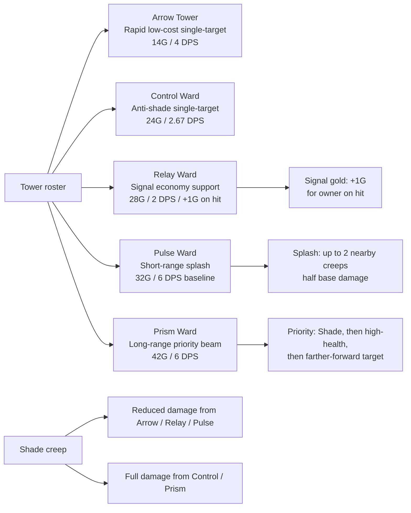
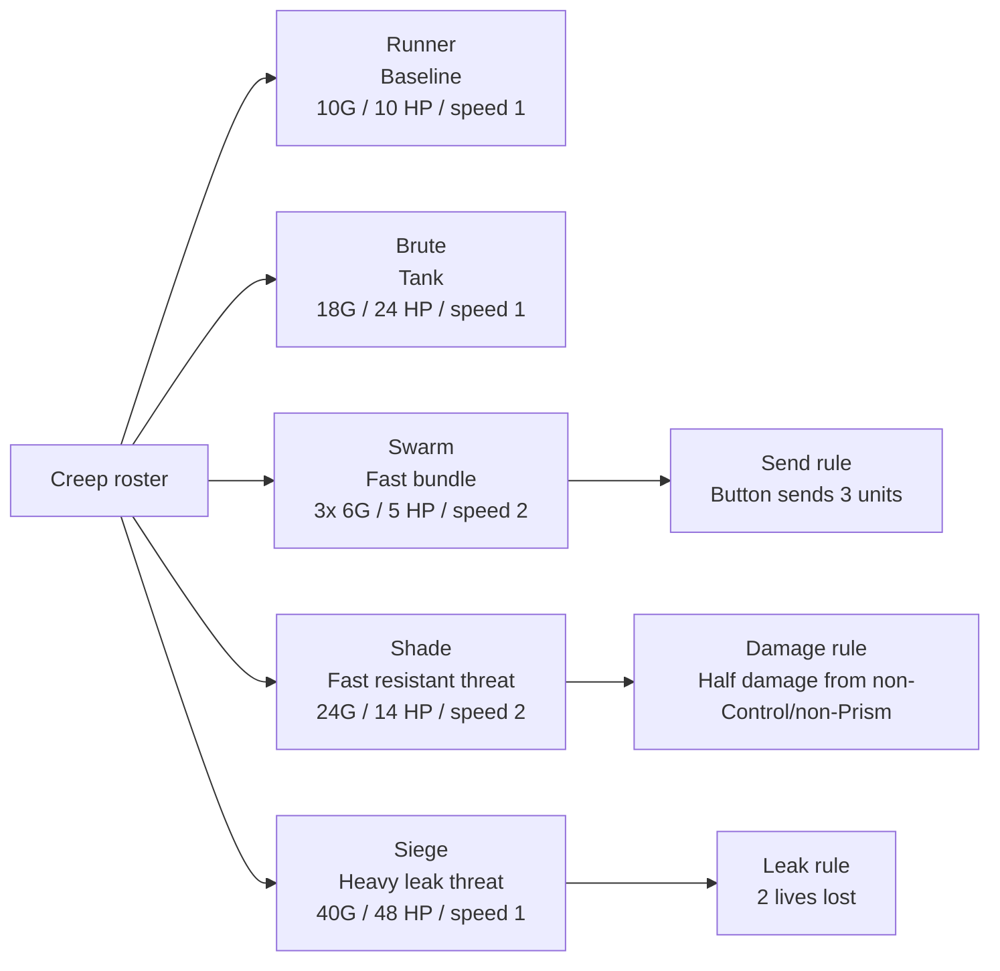
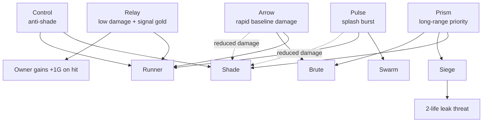

# Tower And Creep Roster

This is the current code-derived gameplay roster for the local vertical-slice build.

Source of truth:

- `src/LTW.Simulation/Bridge/SampleVerticalSliceContent.cs`
- `src/LTW.Simulation/Combat/CombatService.cs`
- `unity/LTW.UnityClient/Assets/Scripts/Simulation/UnitySimulationDriver.cs`
- `unity/LTW.UnityClient/Assets/Scripts/Simulation/UnityCommandAdapter.cs`

## Balance Math Assumptions

- Unity local client tick rate: `4` simulation ticks per second.
- Tower cooldown seconds: `AttackCooldownTicks / 4`.
- Tower shots per second: `4 / AttackCooldownTicks`.
- Listed tower DPS is single-target baseline DPS before special target rules.
- Tower range uses Manhattan grid distance.
- Creep `SpeedPerSecond` is currently applied once per simulation tick, so current local-client cells/sec is `SpeedPerSecond * 4`.
- Swarm is sent as a bundle of `3` units from the current Unity send drawer.

## Tower Roster

15 towers in three lines of five, surfaced through the build palette's ARCANE / FOUNDRY / GROVE
category picker. The client reads every cost from `ContentCatalog` at display time
(`UnityCommandAdapter.TowerCost`) - it keeps no copy, because it used to and the copies drifted three
ways at once.

**Every tower now has a special behaviour.** "Baseline DPS" is single-target damage BEFORE any of them
apply, so it understates Spore Cloud against fat creeps and Tesla against a queue, and overstates
Repair Drone (whose contribution is other towers' reach).

| Tower | ID | Line | Cost | Range | Damage / shot | Cooldown ticks | Baseline DPS | DPS/gold | Special behavior |
| --- | --- | --- | ---: | ---: | ---: | ---: | ---: | ---: | --- |
| Arrow Tower | `tower.arrow` | Arcane | 14 | 2 | 2 | 2 | 4.00 | 0.286 | Front-most target. Shade takes reduced damage. |
| Control Ward | `tower.control` | Arcane | 24 | 3 | 2 | 3 | 2.67 | 0.111 | Front-most target, full damage to Shade. Range raised 2 to 3 because at 2 it was strictly dominated by Arrow. |
| Relay Ward | `tower.relay` | Arcane | 28 | 2 | 2 | 4 | 2.00 | 0.071 | +1 gold to its owner on every hit. Deliberately weak on stats; exempt from the no-domination test for that reason. |
| Pulse Ward | `tower.pulse` | Arcane | 32 | 1 | 6 | 4 | 6.00 | 0.188 | Half-damage splash to up to 2 creeps within 1 cell of the target - rewards a CLUMP. |
| Prism Ward | `tower.prism` | Arcane | 42 | 4 | 9 | 6 | 6.00 | 0.143 | Prioritises Shade, then higher health, then farther forward. Full damage to Shade. |
| Gatling Turret | `tower.gatling` | Foundry | 30 | 2 | 2 | 1 | 8.00 | 0.267 | None. Fires every tick - the fastest plain single-target tower. |
| Tesla Coil Spire | `tower.tesla` | Foundry | 38 | 3 | 5 | 3 | 6.67 | 0.175 | **Chain Arc.** After the primary hit the bolt jumps BACK down the queue up to 2 more times, halving each hop, each within 2 cells of the last link. Rewards a LINE, where Pulse rewards a clump. Backward is load-bearing: selection picks the front-most creep, so a forward chain would find nothing ahead of it and never fire. |
| Foundry Core | `tower.foundry` | Foundry | 52 | 2 | 14 | 6 | 9.33 | 0.179 | **Stack Mortar.** No damage when it fires. The shell lands 2 ticks later on a pre-computed cell, hitting every creep standing there. It only targets creeps it can actually lead, so a launched shell always lands on something. Cannot fire while a shell is in the air. |
| Barricade Bastion | `tower.barricade` | Foundry | 18 | 2 | 5 | 4 | 5.00 | 0.278 | **Fixed Emplacement.** Never turns; engages only creeps that have not passed its own row. Paid for with range 1-to-2 and damage 3-to-5. |
| Repair Drone Spire | `tower.repair_drone` | Foundry | 40 | 3 | 3 | 2 | 6.00 | 0.176 | **Servicing.** Every orthogonally adjacent tower of the same owner fires one tick faster (floor 1). Does not stack, and does nothing for a tower already at cooldown 1 (Gatling). Replaced a +1 RANGE buff that measured as decoration - see GD_TUNING_LOG 2026-07-29. |
| Elder Canopy | `tower.elder_canopy` | Grove | 46 | 5 | 8 | 6 | 5.33 | 0.116 | **Deep Roots.** Targets the creep furthest BACK in range rather than the leader. With the roster's longest reach (5) it engages arrivals at the mouth of the lane, softening a wave before anything else sees it. |
| Sapling Sentinel | `tower.sapling` | Grove | 10 | 2 | 2 | 3 | 2.67 | 0.267 | **Grovebond.** +1 damage per orthogonally adjacent Grove tower of the same owner and lane, capped at +3. Diagonals do not bond. |
| Bloomheart Totem | `tower.bloomheart` | Grove | 22 | 2 | 4 | 3 | 5.33 | 0.242 | **Crowd Bloom.** +1 damage for every other creep sharing the target's cell, capped at +3. Answers a stacked send by punching through its leader, where Pulse answers the same board by thinning the whole group. Replaced "Reaping Bloom" after measurement showed that rule was inert in 0% of organic scenarios - see GD_TUNING_LOG 2026-07-29. |
| Thorn Snare Totem | `tower.thorn_snare` | Grove | 34 | 2 | 5 | 3 | 6.67 | 0.196 | **Bramble Hold.** Creeps that start a tick in its zone move at exactly half speed. The zone is exactly 3 route cells - it used to widen to every cell the tower could see (5 at range 2), which made it an automatic purchase. Range 1-to-2 is required by the mechanic. |
| Spore Cloud Bloom | `tower.spore_cloud` | Grove | 34 | 3 | 4 | 6 | 2.67 | 0.078 | **Rot.** Damage is max(authored, target max health / 6): inert against chaff, the hardest counter to anything fat. Reads AUTHORED max health. |

## Tower Role Map

## Creep Roster

| Creep | ID | Role / pressure type | Button bundle | Unit cost | Button cost | Income gain / unit | Button income gain | Health / unit | Speed stat | Current cells/sec | Kill bounty / unit | Leak bounty / unit | Lives lost on leak | Special behavior |
| --- | --- | --- | ---: | ---: | ---: | ---: | ---: | ---: | ---: | ---: | ---: | ---: | ---: | --- |
| Runner | `creep.runner` | Baseline pressure runner | 1 | 10 | 10 | +1 | +1 | 10 | 1 | 4 | 1 | 2 | 1 | Simple baseline creep. |
| Brute | `creep.brute` | Durable tank pressure | 1 | 18 | 18 | +2 | +2 | 24 | 1 | 4 | 2 | 3 | 1 | High health for its cost tier. |
| Swarm | `creep.swarm` | Fast multi-unit pressure | 3 | 6 | 18 | +1 | +3 | 5 | 2 | 8 | 1 | 1 | 1 each | Current send button creates 3 low-health fast units. |
| Shade | `creep.shade` | Fast stealth/resistance pressure | 1 | 24 | 24 | +3 | +3 | 14 | 2 | 8 | 2 | 4 | 1 | Takes reduced damage from non-Control and non-Prism towers. |
| Siege | `creep.siege` | Heavy leak-threat tank | 1 | 40 | 40 | +4 | +4 | 48 | 1 | 4 | 4 | 6 | 2 | Leaking Siege costs the defender 2 lives. |

## Creep Roster — Category 2 (2026-07-28)

Second five, wired in behind the send menu's Category 2 (`docs/CONTENT_ROSTER_EXPANSION_PLAN.md`'s "second five," `docs/GAME_MENU_AND_RUNTIME_FLOW.md`'s Send Drawer). First pass — see `docs/GD_TUNING_LOG.md`'s 2026-07-28 entry for the design rationale behind each stat choice; treat as tunable, not final.

| Creep | ID | Role / pressure type | Button bundle | Unit cost | Income gain / unit | Health / unit | Speed stat | Current cells/sec | Kill bounty / unit | Leak bounty / unit | Special behavior |
| --- | --- | --- | ---: | ---: | ---: | ---: | ---: | ---: | ---: | ---: | --- |
| Crystal Wisp | `creep.wisp` | Cheap fast chip pressure | 1 | 5 | +1 | 4 | 3 | 12 | 1 | 1 | Cheapest and fastest unit in the roster; tests constant, low-cost pressure. |
| Ash Revenant | `creep.revenant` | Fragile economy-enabling glass cannon | 1 | 16 | +4 | 8 | 2 | 8 | 1 | 2 | Highest income-per-cost ratio; punishes a defender who doesn't finish it off. Visual scale raised 0.85→1.05 on 2026-07-28 so it reads as a distinct target rather than chaff; the one deliberate exception to the health-driven silhouette rule — see `docs/GD_TUNING_LOG.md`. |
| Obsidian Brute | `creep.obsidian_brute` | Heavier, later-tier tank | 1 | 30 | +3 | 60 | 1 | 4 | 3 | 4 | Highest health in the roster — a heavier, later-game answer to `creep.brute`, not a duplicate of it. |
| Serpent Coil | `creep.serpent` | Sustained midgame grinder | 1 | 20 | +2 | 32 | 1 | 4 | 2 | 3 | No gimmick — a solid all-rounder that punishes overinvestment. Cost cut 22→20 on 2026-07-28 (see `docs/GD_TUNING_LOG.md`); was strictly dominated by Obsidian Brute at 22. |
| Spire Turret Walker | `creep.turret_walker` | Fast heavy threat | 1 | 38 | +4 | 40 | 2 | 8 | 4 | 5 | Comparable cost/health to Siege but faster and with no leak-life penalty — tests whether towers can keep up with a heavy that isn't slow. |

## Creep Roster — Category 3 "ELITE" (2026-07-28)

Third five. Unlike the first ten these are Meshy **auto-rigged bipeds**, arriving with a 24-bone
humanoid rig and walk/run clips already authored — see `docs/GD_TUNING_LOG.md` for the pipeline
difference and the stats rationale. A deliberately later tier: costs and health run past the
first ten, paced by price rather than by a cooldown exemption.

| Creep | ID | Role / pressure type | Button bundle | Unit cost | Income gain / unit | Health / unit | Speed stat | Current cells/sec | Kill bounty / unit | Leak bounty / unit | Special behavior |
| --- | --- | --- | ---: | ---: | ---: | ---: | ---: | ---: | ---: | ---: | --- |
| Zephyr Wraith | `creep.zephyr` | Fast evasive skirmisher | 1 | 22 | +2 | 12 | 3 | 12 | 2 | 3 | Ties Crystal Wisp as the fastest unit, with real health behind it. Uses the running clip. |
| Fracture Burrower | `creep.burrower` | Mid-tier sustained tank | 1 | 26 | +2 | 44 | 1 | 4 | 3 | 4 | No gimmick — steady health pressure that punishes thin coverage. |
| Umbral Stalker | `creep.stalker` | Ambusher | 1 | 28 | +3 | 20 | 2 | 8 | 2 | 4 | Fast for its cost; tests whether defence reaches past the opening cluster. Uses the running clip. |
| Aegis Warden | `creep.warden` | Armoured advance | 1 | 34 | +3 | 55 | 1 | 4 | 3 | 4 | Second-highest health in the roster; asks whether defence DPS has scaled. |
| Siege Colossus | `creep.colossus` | Late-game wall | 1 | 52 | +5 | 90 | 1 | 4 | 5 | 8 | Highest cost and health anywhere in the roster. Named Colossus, not Siege, to stay distinct from `creep.siege`, which it outclasses rather than duplicates. |

## Creep Role Map

## Tower Matchups Against Creeps

## Quick Balance Read

| Observation | Why it matters |
| --- | --- |
| Arrow is now a low-cost rapid baseline tower, not the dominant raw DPS option. | It should remain useful as an opener without crowding out specialized towers. |
| Control has low DPS but ignores the Shade reduction rule. | It is the dedicated answer to Shade rather than a general damage upgrade. |
| Relay now has low damage plus +1 gold on hit. | Its value should come from sustained signal economy during pressure, not direct kills. |
| Pulse is the best swarm answer when targets are clustered. | Its real value depends on creep density near the target. |
| Prism is expensive but has long range, high damage, and Shade priority. | It is the premium answer to Shade, Siege, and high-health threats. |
| Swarm's button value is bundle-based. | Balance should compare the 18G / +3 income button, not just the 6G unit. |
| Siege is the largest defensive failure threat. | Its 2-life leak loss means it should be visually and mechanically distinct. |
