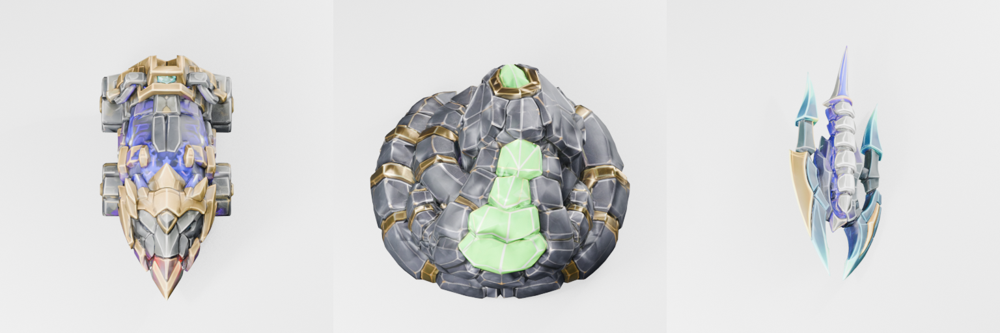
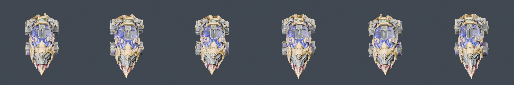
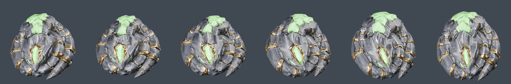
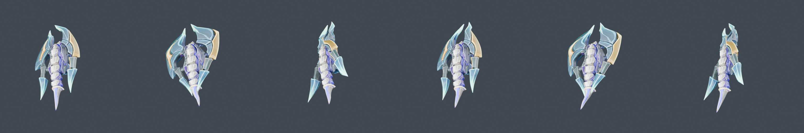
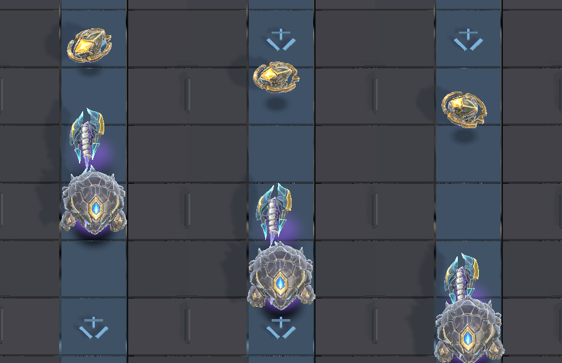
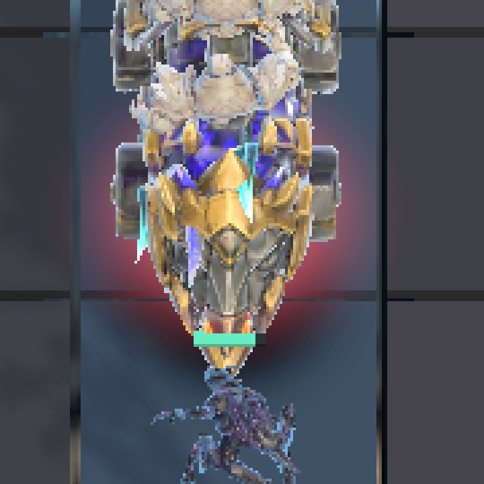

# Creep rigs, wave 2.3 — Siege, Serpent, Runner

Date: 2026-08-03
Unity: 6000.5.3f1
Blender: 5.2.0 LTS
Captures: `LTW.UnityClient.Editor.MotionCaptureRunner.CaptureMotionSequence`, 1080x1920,
plus per-rig match-camera renders from the rig scripts themselves.

Applies OPEN_ITEMS item 4's standing rule — *render-check from the actual game camera before
investing in leg articulation* — to the three creeps item 11 nominated as best return per
rig. The check was run **before** any rig was written, which is the whole point of the rule,
and it changed what got built.

## The finding: none of the three has legs

Item 11 reads as "seven creeps have no animation, give them some", and the natural next step
after the golems and the walker is to point `rig_quadruped_creep.py` at the next creep along.
Rendering all three from the match camera first, from the static prepared meshes, says that
would have been wrong three times over.

*Left to right: Siege, Serpent, Runner — prepared meshes, no armature, rendered from the
match camera with each creep's own `ImportEulerAngles` applied.*

| Creep | What it actually is | Measured |
| --- | --- | --- |
| Siege | A four-**wheeled** armoured ram | Four discs r=0.098 on the flanks, hubs at z=0.129, front pair x=-0.022 and rear x=+0.319. Both flanks agree to 0.002 on every figure. |
| Serpent | A closed **coil** | Ground band occupied at all twelve 30-degree sectors, outer radius 0.407-0.473. Radial mass peaks twice (r=0.26, r=0.40) — two turns. Head raised at the centre, z 0.481-0.545. |
| Runner | A **floating** blade | 52 of 7702 verts sit below 18% of height, and they are one stalk spanning x [-0.070,+0.023]. Body mass starts at z=0.069. Nothing to plant. |

This is the same class of finding as the Brute's, one step earlier. The Brute's rule is "the
legs may be occluded"; here there are no legs to occlude. Occlusion itself was clean on all
three — wheels, coil segments and blades are all unobstructed from this camera, none of them
sits under an overhanging shell.

## What was built instead

Three scripts, one per body plan, following `rig_turret_walker.py`'s precedent of splitting
a creep out rather than widening a shared script past what it is about.

### Siege — `tools/art_pipeline/rig_wheeled_ram.py`

*Six frames across the 52-frame clip, match camera. The wheels turn; the chassis rolls and
the mantlet tracks on a different period, so no two frames repeat a pose.*

A wheel is a limb with no stride limit, which is exactly what the walker lacked. Its contact
speed is `2*pi*r` per revolution and the revolution rate is free, so the rate was solved from
the creep's real ground speed rather than traded off against legibility. 52 frames carrying 3
revolutions lands 0.016% off the exact figure. **Measured skate 0.99x** — see the table below.

### Serpent — `tools/art_pipeline/rig_coiled_serpent.py`

*Six frames across the 38-frame clip. The wave travels once around the ring; the gold bands
are what carry it visually.*

Rigged as the ring it geometrically is: eight sector bones radiating from the coil axis, with
a wave travelling around them once per clip. The wave is primarily **tangential**, not
vertical, because the camera is 30 degrees off vertical and keeps 87% of a horizontal shift
against 50% of a vertical one — the same projection argument that put a yaw scan on the
walker.

### Runner — `tools/art_pipeline/rig_bladed_runner.py`

*Six frames across the 30-frame clip. Left and right blades run half a cycle apart, so the
head-on silhouette is asymmetric at every frame but the two crossings.*

## In game, at real size

*Three consecutive capture frames 0.3s apart, cropped from 1080x1920 match-camera captures.
Runner top, Serpent below. The blade pose and the coil's band arrangement both change frame
to frame while the creeps advance.*

*The Siege in the lane, same capture setup, 3x crop. Plow nose pointing down-lane, and all
four wheels visible on the flanks — the item 4 occlusion check confirmed in the running game
rather than only in Blender. Measured ~90 px across the lane against 84 px predicted.*

The Siege needed its own capture run: the send cooldown means only a few creeps leave the gate
in a 16-frame window, and at 40 gold it is late in the queue. Its wheels-turning evidence is
the match-camera cycle sheet above, which holds the creep still; the in-game frames are 6s
apart, by which point it has travelled eight cells and cannot be compared pose to pose.

## Gait measurement

`tools/art_pipeline/measure_creep_gait.py`, restored from `ab0553f` and generalised off named
leg bones onto the deformed mesh. Ground speed is `SpeedPerSecond 1 / BaseMovementCost 3` at 4
ticks/sec = **1.3333 world units/sec**, played back at 1.00x (all three are speed 1, which is
`CreepWalkReferenceSpeed`).

| Creep | Clip | Driving part | Contact speed | Needs | **Skate** |
| --- | ---: | --- | ---: | ---: | ---: |
| Siege | 52f / 2.167s | WheelBR | 0.8413 | 0.8308 | **0.99x** |
| Serpent | 38f / 1.583s | Coil4 | 0.1101 | 0.9186 | **8.34x** |
| Runner | 30f / 1.250s | BladeL | 0.0883 | 1.0463 | **11.85x** |

For comparison: Spire Turret Walker 51x, then 8.3x after its rework.

Read these honestly. **Only the Siege's number is a gait number.** The Serpent's coil and the
Runner's blades are not pushing against the ground, so their figures say "this creep is being
carried along the lane", which is true and cannot be fixed by a clip — it is true of every
creep in the roster that does not walk. The Runner's `lateral/travel = 4.9 WADDLE` flag fires
for the same reason and is a false positive by construction: a blade sweeping sideways is the
intended motion, and the check was written to catch a *walker* swinging its feet sideways.

## Correction to the leg-visibility table

[`../creep-leg-visibility/`](../creep-leg-visibility/) derives every creep's on-screen height
from "normalised to ~1.25 units tall by the intake" and "61.9 pixels per world unit". Both
are wrong, and they do not cancel.

* **Pixels per world unit is ~113, not 61.9.** Measured off the grid in a real 1080x1920
  match-camera capture: clean grid-line spacings give 113 px/cell over spans of 2, 3 and 5
  cells, and one cell is one world unit. The 61.9 came from `orthographicSize = 15.5` in
  `LocalVerticalSliceLauncher`, which is not the camera the match uses —
  `UnityVerticalSliceRenderer.Camera.cs` sets 9.2 scaled by the tilt compensation, i.e. 8.45.
* **Meshes are not normalised to 1.25 units tall.** They are normalised so their LARGEST
  dimension is 0.900, whatever axis that is. `UnitBoundsReport` measures Siege at 0.506 tall,
  Runner 0.448, Swarm and Shade 0.750, Brute 0.622 — not one of them is 1.25, and the prefabs
  import 1:1 with the Blender mesh.
* **And height projects at sin(30) = 0.5**, so a world unit of height is ~56.5 px on screen
  while a world unit of footprint is ~98 px along the lane and ~113 px across it.

Recomputed for these three:

| Creep | Table said | On-screen height | Footprint along lane | Footprint across lane |
| --- | ---: | ---: | ---: | ---: |
| siege | 105 px | **44 px** | 141 px | 84 px |
| serpent | 95 px | **42 px** | 126 px | 148 px |
| runner | 84 px | **31 px** | 112 px | — |

The three creeps picked as "largest, best return per rig" are in fact **short**. What is large
about them is their footprint. That does not invalidate picking them — it sharpens why these
particular rigs are the right ones: wheels, coil wave and blade sweep are all motion in the
horizontal plane, which is the plane this camera preserves, whereas leg articulation is
vertical-plane motion on creeps that are at or under the table's own 35 px threshold.

The table's *ordering* is unaffected — every row is scaled by the same two constants — so
item 11's suggested sequence still holds. Only the absolute numbers, and the conclusion about
which axis of motion to spend on, change.

## Two orientation defects found and fixed

Both were flagged in the source as unverified guesses, and captures were how they resolved.

* **Runner faced backwards.** Its spec comment read "Yaw 90 is a first guess... verifying with
  a capture before trusting the sign." The sign was wrong: the lance is at Blender +X, which
  maps to Unity -X, and yaw 90 sends that to +Z — up the lane. Now 270.
* **Serpent faced backwards.** Yaw 0, uncaptured. Its head faces Blender -Y, which maps to
  Unity +Z, exactly the Brute's original problem. Now 180.

Both are 180-degree flips, so prefab bounds are unchanged and the solved runtime scales in
`Creep3DProofSetGenerator` still hold.

Resolved by measurement, not by eye: a temporary editor probe reported each prefab's geometry
half-width in the outermost 8% of its Z extent at both ends. The Siege's plow gave 0.033
against 0.225 — unambiguous, and it confirmed the axis convention independently of the Brute.
The probe was not kept: its taper heuristic only works on tapered creeps, and it reported the
Brute and Serpent "backwards" when neither is, which is worse than having no tool.
